# Scalan's Meta-programming Idioms   

### Table of contents
- [Introduction](#introduction)
- [Staged Evaluation](#Idiom1)
- [Virtualized Code](#Idiom2)
- [Rep Types](#Idiom3)
- [Reified Lambdas](#Idiom4)
- [Staged Transformation by Re-evaluation](#Idiom5)
- [Rewrite Rules](#Idiom6)
- [Type Virtualization](#Idiom7)
- [Virtualized Method Calls](#Idiom8)
- [Symbols as Object Proxies](#Idiom9) 
- [Reified Types](#Idiom10)
- [First-class Isomorphisms](#Idiom11)
- [First-class Converters](#Idiom12)
- [Isomorphic Specialization](#Idiom13)
- [Multi-stage Transformation Pipeline](#Idiom14) 
- [References](#references)

### Introduction

Scalan is a framework for development of domain-specific compilers in Scala. In particular it supports meta-programming
based on *staged evaluation*. Visit [Scalan Readme](https://github.com/scalan/scalan/blob/master/README.md) for general
introduction about Scalan and how to get started.

The following is the introduction to meta-programming idioms available in Scalan along with example REPL sessions to try
them yourself. The core of Scalan (`scalan-core` module) is application neurtal and generic, thus all the idioms are in
principle applicable to any user domain. See [example applications](applications.md) of Scalan for variuos domains. 

To run all the RERL examples youself you can use your favorit Scala Console. 
The examples are tested with SBT Scala console and Scala Console Run Configuration of IntelliJ IDEA 15.0.2.
In SBT you may need to switch to scalan-core project like it is shown below.

```
$ sbt
[info] Loading project definition from /Users/slesarenko/Projects/scalan/scalan/project
[info] Set current project to scalan (in build file:/Users/slesarenko/Projects/scalan/scalan/)
> project scalan-core
[info] Set current project to scalan-core (in build file:/Users/slesarenko/Projects/scalan/scalan/)
> console
[info] Starting scala interpreter...
[info]
Welcome to Scala version 2.11.7 (Java HotSpot(TM) 64-Bit Server VM, Java 1.8.0_60).
Type in expressions to have them evaluated.
Type :help for more information.
scala> import scalan._
import scalan._
scala>
```

In IDEA run configuration select an appropriate module like `scalan-core` shown below

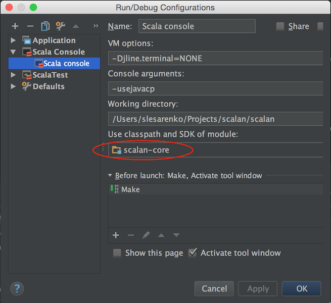

<a name="Idiom1"></a> 
### Idiom 1: Staged Evaluation 

*Staged Evaluation* refers to a special mode of program evaluation (or interpretation). Whereas standard evaluation
aims to produce output data for given input data, staged evaluation of program `P` produces graph-based intermediate
representation of `P`, which can be evaluated normally on later stages. For example, given a program

```scala
  def mvm(matrix: Matrix[Double], vector: Vector[Double]): Vector[Double] =
    DenseVector(matrix.rows.mapBy(r => r dot vector))
```

its staged evaluation will result in construction of the following graph (shown with annotations explaining graphical
notation).

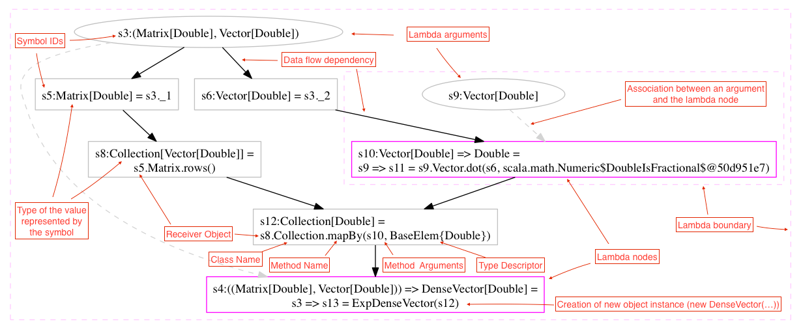

Staged evaluation can be understood as *self-reproducing process*, when a program is stage evaluated it reproduces
itself in a graph-based IR. See also [Isomorphic Specialization by Staged Evaluation
paper](http://pat.keldysh.ru/~slesarenko/) where staged evaluation is defined in a more formalized way.

<a name="Idiom2"></a>
### Idiom 2: Virtualized Code

*Code virtualization* is a systematic program transformation performed manually or automatically by
[Scalanizer](https://github.com/scalan/scalanizer). Thus, after virtualization the following code 

```scala
  def mvm(matrix: Matrix[Double], vector: Vector[Double]): Vector[Double] =
    DenseVector(matrix.rows.mapBy(r => r dot vector))
```

is transformed to 

```scala
  def mvm(matrix: Rep[Matrix[Double]], vector: Rep[Vector[Double]]): Rep[Vector[Double]] =
    DenseVector(matrix.rows.mapBy(fun { r => r dot vector }))
```

Historically, Scalan framework is designed to facilitate easy manual code virtualization as much as it is possible using
standard Scala 2.11 or later compiler. Scalanizer, compiler plugin, allows to automatically virtualize a delimited
fragment of Scala code.

Virtualized code brings us to *"Rep Types"* and *"Reified Lambdas"* idioms.

See also [example code](https://github.com/scalan/scalan/blob/master/linear-algebra/src/test/scala/scalan/linalgebra/LinearAlgebraExamples.scala) and
[test](https://github.com/scalan/scalan/blob/master/linear-algebra/src/test/scala/scalan/linalgebra/MvmTests.scala)

<a name="Idiom3"></a> 
### Idiom 3: Rep Types

The technique was originally introduced in [Polymorphic Embedding](http://dl.acm.org/citation.cfm?id=1449935) and later
developed in [LMS](http://scala-lms.github.io/) staging. It is also known as *lifted embedding* of [Slick
queries](http://slick.typesafe.com/doc/3.1.1/queries.html).

In Scalan, during code virtualization, original types (like `Matrix` and `Vector`) are replaced with Rep types
`Rep[Matrix]` and `Rep[Vector]` correspondingly. Here `Rep` (short for *representation*) is declared as abstract type

```scala
type Rep[+T]
```

Consider simple example

```scala
val x: Rep[Int] = 10
val y = x + 1 
```

This virtualized code can be evaluated normally by using `ScalanDslStd` context object where `Rep` is defined as the
following

```scala
type Rep[+T] = T
```

```
scala> import scalan._
val ctx = new ScalanDslStd 
import ctx._
val x: Rep[Int] = 10
val y = x + 1
import scalan._

scala> ctx: scalan.ScalanDslStd = $anon$1@5935eb9c
scala> import ctx._
scala> x: ctx.Rep[Int] = 10
scala> y: Int = 11
```

Alternatively, it can be evaluated in *staged mode* by using ScalanDslExp context object where `Rep` is defined as the
following

```scala
type Rep[+T] = Exp[T]
```

Here `Exp` is a type of expressions which are represented by graphs instead of *abstract syntax trees* (AST)
 
```
scala> import scalan._
val ctx = new ScalanDslExp {
  override val currentPass = DefaultPass("mypass", Pass.defaultPassConfig.copy(constantPropagation = false))
}
import ctx._
val x: Rep[Int] = 10
val y = x + 1
y.show()

scala> import scalan._
scala> ctx: scalan.ScalanDslExp = $anon$1@3c72c488
scala> import ctx._
scala> x: ctx.Rep[Int] = s2
scala> y: ctx.Rep[Int] = s4
scala> y.show()
```

Note that during staged evaluation each value of the type `Rep` contains a symbol of the graph instead of data values.
In a staged context we can visualize any expression as a graph. Showing `y` give us the following graph

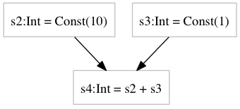

<a name="Idiom4"></a> 
### Idiom 4: Reified Lambdas 

In standard evaluation (when `type Rep[+T] = T`) two type terms `Rep[A] => Rep[B]` and `Rep[A => B]` expand to the same
type `A => B`, in staged evaluation however (when `type Rep[+T] = Exp[T]`) they expand to different types `Exp[A] =>
Exp[B]` and `Exp[A => B]` correspondingly.

To understand the difference consider the following example (in staged context)

```scala
import scalan._ 
val ctx = new ScalanDslExp {
  override val currentPass = DefaultPass("mypass", Pass.defaultPassConfig.copy(constantPropagation = false))
}
import ctx._
val x: Rep[Int] = 10
val inc = (x: Rep[Int]) => x + 1
val y = inc(x)
y.show()

scala> ctx: scalan.ScalanDslExp = $anon$1@3c72c488
scala> import ctx._
scala> x: ctx.Rep[Int] = s2
scala> inc: ctx.Rep[Int] => ctx.Rep[Int] = <function1>
scala> y: ctx.Rep[Int] = s4
```

Which give us the following graph 


Instances of `Rep[A] => Rep[B]` are ordinary Scala functions from symbols to symbols.

Now consider the following example

```scala
scala> 
import scalan._ 
val ctx = new ScalanDslExp 
import ctx._
val x: Rep[Int] = 10
val inc = mkLambda({ (x: Rep[Int]) => x + 1 }, mayInline = false)
val y = inc(x)
y.show()

scala> ctx: scalan.ScalanDslExp = scalan.ScalanDslExp@70cf7d1e
scala> import ctx._
scala> x: ctx.Rep[Int] = s2
scala> inc: ctx.Exp[Int => Int] = s4
scala> y: ctx.Rep[Int] = s7
```
Which give us the following graph 

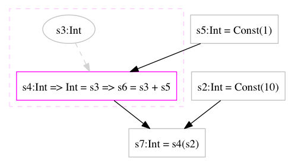

The function `mkLambda` *reifies* the given Scala function and is defined as the following

```scala
def mkLambda[A,B](f: Rep[A] => Rep[B], mayInline: Boolean)(implicit eA: LElem[A], eB: Elem[B]): Rep[A => B]
```

Function `fun` is a shortcut which is used in most cases

```scala
implicit def fun[A,B](f: Rep[A] => Rep[B])(implicit eA: LElem[A], eB: Elem[B]): Rep[A => B] = mkLambda(f, true)
```
Note: type descriptors `LElem` and `Elem` are described in [Idiom 10](#Idiom10).

The functions work in four steps:

- creates a fresh symbol for lambda-bound variable `x` 
- execute argument `f` using the fresh symbol, computing resulting symbol `y`
- store symbols `x` and `y` in special graph node `Lambda(x,y)`
- add `Lambda` node to the graph and return its symbol as result


<a name="Idiom5"></a> 
### Idiom 5: Staged Transformation by Re-evaluation

As shown in [Idiom 3](#Idiom3), one way to build a program graph in Scalan is to execute virtualized code of the program
in staged mode (perform staged evaluation). Here we consider an alternative. Every graph can be *re-evaluated* or
traversed in topological order, visiting graph nodes with respect to the data-flow dependencies of IR. This formally
connects re-evaluation to the semantics of the language and, in a sence, equivalent to staged evaluation of the original
code. More formally this is described in our [Isomorphic Specialization by Staged Evaluation paper](http://pat.keldysh.ru/~slesarenko/).

Each visited node of the original graph is cloned and added under fresh symbol (identifier) to the *sea-of-nodes-like*
universe of Symbol -> Definition dictionary pairs. The mapping between original and cloned nodes is stored during
traversal and is used to keep relationship between cloned nodes. This can be thought of as if the original edges are
also cloned to the edges between the cloned nodes.

It is better illustrated by the following REPL

```scala
import scalan._
val ctx = new ScalanDslExp
import ctx._
val calc = fun { (in: Rep[(Int, (Int, Int))]) =>
  val Pair(a, Pair(b, c)) = in
  a * c + b * c
}

val calcClone = ProgramGraph.transform(calc, NoRewriting)
showGraphs(calc, calcClone)

scala> ctx: scalan.ScalanDslExp = scalan.ScalanDslExp@350bbd5d
scala> import ctx._
scala> calc: ctx.Rep[((Int, (Int, Int))) => Int] = s3
scala> calcClone: ctx.Rep[((Int, (Int, Int))) => Int] = s12
```

Which outputs the following graphs for `calc` and `calcClone` functions

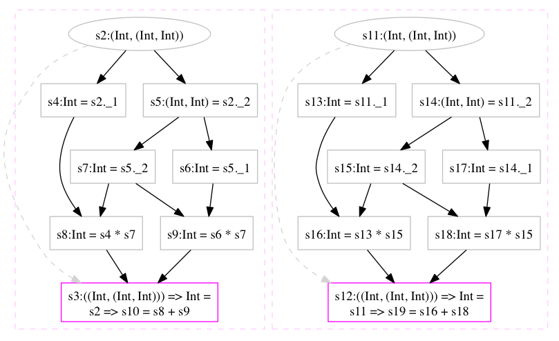

Note, the two graphs are what is called *alpha-equivalent*, they equal up to renaming of their symbols. Thus,
`transform` without rewriting (more precisely with `NoRewriting` rewriter) can be considered as identity transformation
because it produces a new graph, which is alpha-equivalent to the original.

Staged Transformation by re-evaluation idiom allows to implementent [Multi-stage Compilation Pipeline](#Idiom14).

<a name="Idiom6"></a> 
### Idiom 6: Rewrite rules 

Staged evaluation of virtualized code produces a graph-based data structure, step by step adding operations (as nodes)
to the resulting graph. For each new node added to the graph a set of rewrite rules is exercised for applicability.

Conceptually, the set of rewrite rules is a partial function, which can optionally replace the symbol into new symbol.

```scala
def rewrite[A](x: Exp[A]): Option[Exp[A]]
``` 

This function is called for each new node of the graph during staged evaluation. If `rewrite` returns `Some(symbol)`
then this symbol substitutes the original symbol in further evaluation process. A set of rewrite rules should preserve
semantics of the program.

The effect of rewriting is shown in the following REPL session

```scala
import scalan._
val ctx = new ScalanDslExp
import ctx._
val calc = fun { (in: Rep[(Int, (Int, Int))]) =>
  val Pair(a, Pair(b, c)) = in
  a * c + b * c
}

def lemma = postulate { (a: Rep[Int], b: Rep[Int], c: Rep[Int]) =>
  a * c + b * c  <=> (a + b) * c
}
val rw = new RulesRewriter(List(patternRewriteRule(lemma)))
val calcOpt = ProgramGraph.transform(calc, rw)
showGraphs(calc, calcOpt)

scala> ctx: scalan.ScalanDslExp = scalan.ScalanDslExp@350bbd5d
scala> import ctx._
scala> calc: ctx.Rep[((Int, (Int, Int))) => Int] = s3
scala> lemma: ctx.RRewrite[Int]
scala> rw: ctx.RulesRewriter = scalan.primitives.RewriteRulesExp$RulesRewriter@7a9dfe2c
scala> calcOpt: ctx.Rep[((Int, (Int, Int))) => Int] = s21
```

Which outputs the following graphs for `calc` and `calcOpt` functions

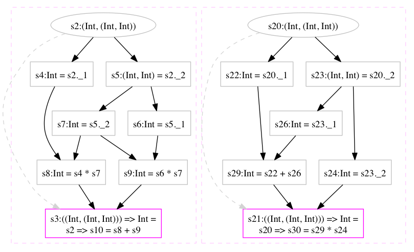

Method `transform` takes the root symbol of the graph and some rewriter and produces a new graph by *staged re-evaluation*
of the original graph (see [idiom 5](#Idiom5)). It tries to rewrite each node of the new graph.

```scala
def transform[A](s: Exp[A], rw: Rewriter = NoRewriting, t: MapTransformer = MapTransformer.Empty): Exp[A]
```

There are many different ways to define rewriters in Scalan:

- by specifying first-class rules with `postulate`
- by using Scala's `PartialFunction[Exp[_], Exp[_]]` 
- by direct implementation of `Rewriter` interface or inheriting from one of the helper classes

Rules can also be associated with compilation phases (see *[Multi-stage compilation pipeline](#Idiom14)* idiom).


<a name="Idiom7"></a> 
### Idiom 7: Type Virtualization 

Besides Scala expressions [Code Virtualization](#Idiom2) is also defined for types. Consider the following example. 

```scala
trait Segment { 
  def start: Int
  def length: Int
  def end: Int
  def shift(ofs: Int): Segment
}
case class Interval(start: Int, end: Int) extends Segment {
  def length = end - start
  def shift(ofs: Int) = new Interval(start + ofs, end + ofs)
}
``` 

Its virtualized version is the following

```scala
trait Segment extends Def[Segment] { self =>
  def start: Rep[Int]
  def length: Rep[Int]
  def end: Rep[Int]
  def shift(ofs: Rep[Int]): Rep[Segment]
}
abstract class Interval(val start: Rep[Int], val end: Rep[Int]) extends Segment {
  def length = end - start
  def shift(ofs: Rep[Int]) = Interval(start + ofs, end + ofs)
}
``` 
See [source code](https://github.com/scalan/scalan/blob/master/core/src/test/scala/scalan/common/Segments.scala)

This transformation is systematic and can be performed either manually or by
[Scalanizer](https://github.com/scalan/scalanizer) compiler plugin.

- every trait should directly or indirectly inherit `Def` 
- all method signatures are virtualized using `Rep` type constructor
- `case class` becomes `abstract class` (which is extended in the boilerplate)
- object instantiation with `new` is replaced with the *factory-like* instantiation.

This virtualized snippet of code is complemented with boilerplate code generated by `scalan.meta.BoilerplateTool`. The
tool parses this virtualized snippet and produces all the necessary boilerplate. (See [the
boilerplate](https://github.com/scalan/scalan/blob/master/core/src/test/scala/scalan/common/impl/SegmentsImpl.scala)
generated for the example above). Boilerplate is completely transparent for the user and its generation will be
implemented by Scalanizer in future versions.

With some limitations, type virtualization works for a rather rich subset of Scala including trait hierarchies, generic
(polymorphic) types and high-kind type parameters.

Moreover, type virtualization is also used by the Scalan framework internally to implement [First-class
Isomorphisms](#Idiom11) and [First-class Converters](#Idiom12).

<a name="Idiom8"></a> 
### Idiom 8: Virtualized Method Calls

Type vitualization brings us to the question of how to perform staged evaluation of method calls.
Consider the following example of staged evaluation of the virtualized code involing method call (`dot` method)

```scala
import scalan._
import scalan.collections._
import scalan.linalgebra._
val ctx = new MatricesDslExp {}
import ctx._
val vvm = fun { p: Rep[(Collection[Double], Collection[Double])] =>
  val Pair(items1, items2) = p
  val v1: Rep[Vector[Double]] = DenseVector(items1)
  val v2: Rep[Vector[Double]] = DenseVector(items2)
  v1.dot(v2)
}
showGraphs(vvm)
```
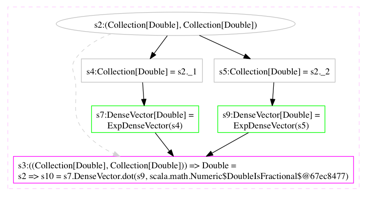

By default, all method calls are reified in the graph as nodes using the following type (visualized in a more
user-friendly form). 

```scala
case class MethodCall(receiver: Exp[_], method: Method, args: List[AnyRef]) extends Def[Any] 
```

This node has a semantics of delayed method invocation, which can be performed on later stages. The concrete mechanism
of method call reification is described in [symbols as object proxies](#Idiom9) idiom. 

We can implement actual invocation of delayed method calls, for example, by defining a simple rewriter.

```scala
object InvokeRewriter extends Rewriter {
  def apply[T](x: Exp[T]): Exp[T] = x match {
    case Def(call: MethodCall) => // extract definition for a given symbol and check it is MethodCall
      call.tryInvoke match {
        case InvokeSuccess(res) => res.asRep[T]
        case _ => x
      }
    case _ => x
  }
}
```

In this code the logic behind `tryInvoke` is the following (see [source
code](https://github.com/scalan/scalan/blob/master/core/src/main/scala/scalan/Proxy.scala) for more details)

```scala
def tryInvoke: InvokeResult = receiver match {
  case Def(d) =>   // extract definition for a given symbol
    try {
      InvokeSuccess(method.invoke(d, args: _*).asInstanceOf[Exp[_]])
    } catch {
      case e: Exception => InvokeFailure(baseCause(e))
    }
  case _ => InvokeImpossible
}
```

Note, that graph is built from the deepest point in call stack. The symbol returned by `invoke` method is already added
to the graph during execution of the method `invoke`.

Above mentioned `InvokeRewriter` is used in Scalan by default so that method invocation is controlled by
`isInvokeEnabled` method that can be overriden. The method `dot` is shown below 

```scala
abstract class DenseVector[T](val items: Rep[Collection[T]])(implicit val eT: Elem[T])
  extends Vector[T] {
  def dot(other: Rep[Vector[T]])(implicit n: Numeric[T]): Rep[T] = other match {
    case SparseVector(nonZeroIndicesL, nonZeroValuesL, _) =>
      (items(nonZeroIndicesL) zip nonZeroValuesL).map { case Pair(v1, v2) => v1 * v2 }.reduce
    case _ =>
      (other.items zip items).map { case Pair(v1, v2) => v1 * v2 }.reduce
  }
}
```

In the following example the function `vvm` is reified in the context when invocation is enabled for all
method calls.

```scala
import java.lang.reflect.Method
import scalan._
import scalan.collections._
import scalan.linalgebra._
val ctx = new MatricesDslExp { override def isInvokeEnabled(d: Def[_], m: Method) = true }
import ctx._
val vvm = fun { p: Rep[(Collection[Double], Collection[Double])] =>
  val Pair(items1, items2) = p
  val v1: Rep[Vector[Double]] = DenseVector(items1)
  val v2: Rep[Vector[Double]] = DenseVector(items2)
  v1.dot(v2)
}
showGraphs(vvm)
```
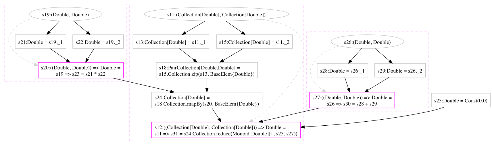


<a name="Idiom9"></a> 
### Idiom 9: Symbols as Object Proxies 

During staged evaluation each variable of the virtualized code has type `Exp[T]` for some `T` and contains a
symbol of the graph instead of data values (See [Idiom 3](#Idiom3)).

So what does it mean to call the method `dot` on the variable `v1` of type `Rep[Vector[Double]]`? How does Scala
compiler resolve `dot` method name?

```scala
val vvm = fun { p: Rep[(Collection[Double], Collection[Double])] =>
  val Pair(items1, items2) = p
  val v1: Rep[Vector[Double]] = DenseVector(items1)
  val v2: Rep[Vector[Double]] = DenseVector(items2)
  v1.dot(v2)
}
```

For each type `T` which is virtualized as it is described in [Idiom 7](#Idiom7) `BoilerplateTool` generates a special
implicit conversion. Here is what is generated for `Vector` type.

```scala
  implicit def proxyVector[T](p: Rep[Vector[T]]): Vector[T] = {
    proxyOps[Vector[T]](p)(scala.reflect.classTag[Vector[T]])
  }
```

This implicit conversion wraps each `Rep` typed variable with [dynamic
proxy](https://docs.oracle.com/javase/8/docs/technotes/guides/reflection/proxy.html) object using the generic method
`proxyOps`. This means that the method `dot` is called at the proxy instance and this call is intercepted by dynamic
proxy `InvocationHandler`. Inside `InvocationHandler` we have all the data in order to create `MethodCall` node:
receiver, method and args array. Created node is added to the graph and associated with a fresh symbol, this symbol is
returned as the result of the method call.

<a name="Idiom10"></a> 
### Idiom 10: Reified Types 

Scalan supports full type reification in virtualized code. In other words, the virtualized code is augmented to carry
information about the types of values. Runtime information about elements of type `T` is
represented by instances of type `Elem[T]` which analogous to `TypeTag` or `Manifest` types of Scala.

Consider the following example

```scala
  def mvm[T:Numeric](matrix: Matrix[T], vector: Vector[T]): Vector[T] =
    DenseVector(matrix.rows.mapBy(r => r.dot(vector)))
```

After its virtualization the method `mvm` will have an additional context bound `Elem`.

```scala
  def mvm[T:Numeric:Elem](matrix: Rep[Matrix[T]], vector: Rep[Vector[T]]): Rep[Vector[T]] =
    DenseVector(matrix.rows.mapBy(r => r.dot(vector)))
```

Type passing style may add additional syntactic noise to the virtualized code, but `Elem` types (as type descriptors)
facilitate generic (aka polytypic) programming patterns and thus allow development of generic meta-programs. 

```scala
import scalan._
import scalan.collections._
val ctx = new CollectionsDslExp {}
import ctx._
def fromArray[T: Elem](arr: Rep[Array[T]]): Coll[T] = implicitly[Elem[T]] match {
  case e: PairElem[a, b] =>
    implicit val ea = e.eFst
    implicit val eb = e.eSnd
    val pairs = arr.asRep[Array[(a, b)]]
    val as = fromArray[a](pairs.map { _._1 })
    val bs = fromArray[b](pairs.map { _._2 })
    as zip bs
  case e => CollectionOverArray(arr)
}
val arr: Rep[Array[Int]] = Array(1, 2, 3)
val pairs: Rep[Array[(Int,Int)]] = Array((1,1), (2,2), (3,3))
showGraphs(fromArray(arr), fromArray(pairs))
```
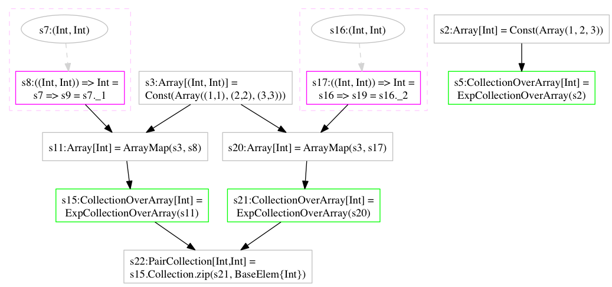

Note how the function `fromArray` is recursively defined over the structure of type descriptor and for the two similar
invocations it produces completely different graphs.

<a name="Idiom11"></a> 
### Idiom 11: First-class Isomorphisms

Isomorphism in Scalan is a special abstraction to capture bijective correspondence between two types. It is defined by
the following virtualized trait.

```scala
trait IsoUR[From,To] extends Def[IsoUR[From,To]]{
  def eFrom: Elem[From] 
  def eTo: Elem[To]
  def from(p: Rep[To]): Rep[From]
  def to(p: Rep[From]): Rep[To] 
}
```

As any virtualized type, IsoUR requires boilerplate code to be generated. This means that isomorphisms are treated as
first-class citizens during staged evaluation. In particular they can be generated as any other functions.

```scala
import java.lang.reflect.Method
import scalan._
val ctx = new ScalanDslExp { override def isInvokeEnabled(d: Def[_], m: Method) = true }
import ctx._
val iso = getStructWrapperIso(element[((Int, (Long, Double)), (String, Boolean))])
showGraphs(iso.fromFun, iso.toFun)
scala> iso: ctx.Exp[ctx.IsoUR[_$33,((Int, Double), String)]] forSome { type _$33 } = s15
```
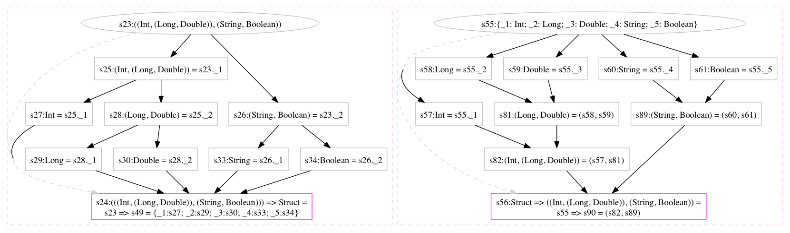

Note: value `iso` has expression type and thus it is a symbol of some graph node. Method `getStructWrapperIso` is generic
and works for any type descriptor. It builds an isomorphism between given type and some corresponding flat structure (tuple).

Another example

```scala
import java.lang.reflect.Method
import scalan._
val ctx = new ScalanDslExp { override def isInvokeEnabled(d: Def[_], m: Method) = true }
import ctx._
val iso = getStructWrapperIso(element[(Array[(Long, Double)], (String, Boolean))])
showGraphs(iso.fromFun, iso.toFun)
```
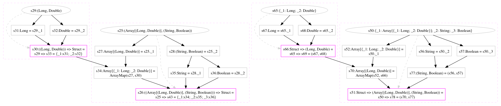

Many different implementations of `IsoUR` are defined in Scalan and each `IsoUR` instance is a node of the IR. 

Consider concrete implementation of virtualized type `Segment`

```scala
abstract class Interval(val start: Rep[Int], val end: Rep[Int]) extends Segment {
  def length = end - start
  def shift(ofs: Rep[Int]) = Interval(start + ofs, end + ofs)
}
```

One specific implementation of `Iso` (called *representation isomorphism*) is generated in boilerplate

```scala
  type IntervalData = (Int, Int)
  class IntervalIso extends EntityIso[IntervalData, Interval] with Def[IntervalIso] {
    override def from(p: Rep[Interval]) =
      (p.start, p.end)
    override def to(p: Rep[(Int, Int)]) = {
      val Pair(start, end) = p
      Interval(start, end)
    }
    lazy val eFrom = pairElement(element[Int], element[Int])
    lazy val eTo = new IntervalElem(self)
    lazy val selfType = new IntervalIsoElem
  }
```

```scala
import java.lang.reflect.Method
import scalan._
import scalan.common._
val ctx = new SegmentsDslExp { override def isInvokeEnabled(d: Def[_], m: Method) = true }
import ctx._
val iso = isoInterval
showGraphs(iso.fromFun, iso.toFun)
```
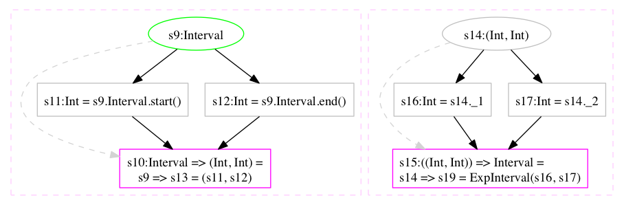

Representation isomorphisms are an integral part of Scalan's staging infrastructure.  
Besides representation isomorphisms there are also combinators which can be used to produce new
isos from existing isos. For example consider an implementation of `IsoUR` for a product type (see [source
code](https://github.com/scalan/scalan/blob/master/core/src/main/scala/scalan/Views.scala)).

```scala
abstract class PairIso[A1, A2, B1, B2]
    (val iso1: Iso[A1, B1], val iso2: Iso[A2, B2])
    (implicit val eA1: Elem[A1], val eA2: Elem[A2], val eB1: Elem[B1], val eB2: Elem[B2])
  extends IsoUR[(A1, A2), (B1, B2)] {
  lazy val eFrom: Elem[(A1, A2)] = element[(A1, A2)]
  lazy val eTo: Elem[(B1, B2)] = element[(B1, B2)]

  def from(b: Rep[(B1, B2)]) = {
    Pair(iso1.from(b._1), iso2.from(b._2))
  }
  def to(a: Rep[(A1, A2)]) = {
    Pair(iso1.to(a._1), iso2.to(a._2))
  }
}
```

In Scalan isomorphisms can be composed in many different ways.

```scala
import java.lang.reflect.Method
import scalan._
import scalan.common._
val ctx = new SegmentsDslExp { override def isInvokeEnabled(d: Def[_], m: Method) = true }
import ctx._
val interval = isoInterval // method generated in boilerplate for each virtualized class  
val slice = isoSlice 
val pairs = pairIso(interval, slice)
val flatten = getStructWrapperIso(pairs.eFrom) 
val iso = flatten >> pairs
showGraphs(iso.fromFun, iso.toFun)
```
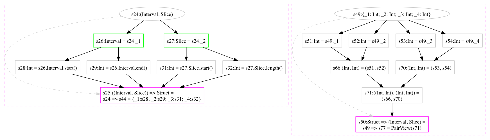

One of the applications of isomorphisms is an automatic generation of converters between different
implementations of the same abstract data type. Consider conversion between `SparseVector` and `DenseVector`.

```scala
import scalan._
import scalan.linalgebra._
class Ctx extends MatricesDslExp { override def invokeAll = true }
val ctx = new Ctx
import ctx._
val sparse2dense = fun { v: Rep[SparseVector[Double]] =>
  DenseVector(v.items)
}
showGraphs(sparse2dense)
```
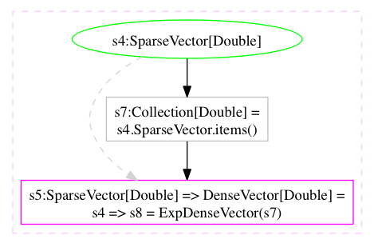

Even though invocation of all the methods is requested, the method `items` cannot be performed, because `v` is lambda
bound variable and the corresponding symbol doesn't have definition, thus there is no object whose method we can call
(see [Idiom 8](#Idiom8)).

However, we can construct `SparseVector` object from *sparse row data format* then perform conversion to `DenseVector`
object and then request *dense row data format*. The format types are generated in boilerplate based on arguments of
the primary constructors of the classes and defined as the following

```scala
  type SparseVectorData[T] = (Collection[Int], (Collection[T], Int))
  type DenseVectorData[T] = Collection[T]
```

The described dataflow graph is constructed in the following example

```scala
import scalan._
import scalan.linalgebra._
class Ctx extends MatricesDslExp { override def invokeAll = false }
val ctx = new Ctx
import ctx._
def sparseData2denseData = fun { data: Rep[SparseVectorData[Double]] =>
  val v = SparseVector(data)
  DenseVector(v.items).toData
}
showGraphs(sparseData2denseData)
```
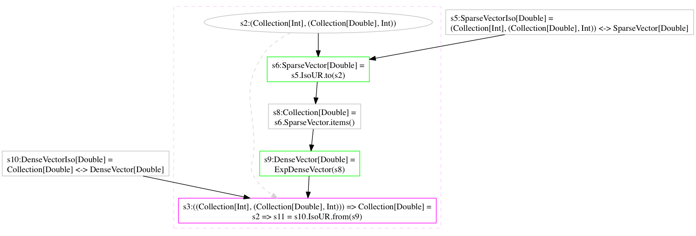

Note, that creation of an instance is implemented by applying the method `to` of the representation iso associated with
`SparseVector` virtualized class (see [Idiom 11](#Idiom11)) and to extract the data from an object the method `from` is
called from the corresponding (maybe different) iso class.

In this graph, method calls of `to` and `from` methods can be executed, thus if we request execution of all method
calls, the same source code will result in generation of different graph.

```scala
import scalan._
import scalan.linalgebra._
class Ctx extends MatricesDslExp { override def invokeAll = true }
val ctx = new Ctx
import ctx._
def sparseData2denseData = fun { data: Rep[SparseVectorData[Double]] =>
  val v = SparseVector(data)
  DenseVector(v.items).toData
}
showGraphs(sparseData2denseData)
```
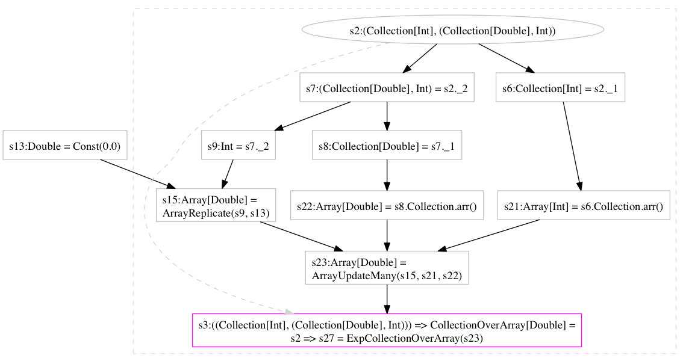

It is easy to recognize which converstion algorithm is represented by the constructed graph.

<a name="Idiom12"></a> 
### Idiom 12: First-class Converters

The function like `sparseData2denseData` can be generated automatically for two virtualized classes if they are
different implementations of the same trait, provided an additional requirement is satisfied. 

Consider the following function

```scala
val vector2dense = fun { v: Rep[Vector[Double]] =>
  DenseVector(v.items)
}
```

It performs conversion from any `Vector` to `DenseVector`. In particular if we apply it to `SparseVector` and
`ConstVector` we can generate required converters.

```scala
import scalan._
import scalan.linalgebra._
class Ctx extends MatricesDslExp { override def invokeAll = true }
val ctx = new Ctx
import ctx._
val vector2dense = fun { v: Rep[Vector[Double]] =>
  DenseVector(v.items)
}
val sparseData2denseData = fun { data: Rep[SparseVectorData[Double]] =>
  val v = SparseVector(data)
  vector2dense(v).toData
}
val constData2denseData = fun { data: Rep[ConstVectorData[Double]] =>
  val v = ConstVector(data)
  vector2dense(v).toData
}
showGraphs(sparseData2denseData, constData2denseData)
```
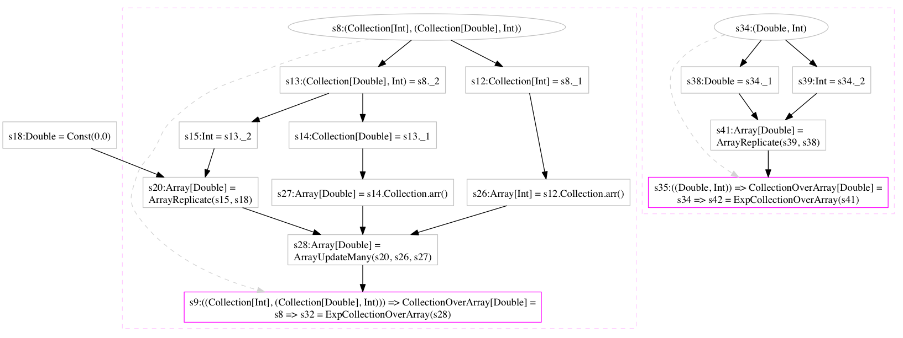

However, attempt to write converter to `ConstVector` fails

```scala
import scalan._
import scalan.linalgebra._
class Ctx extends MatricesDslExp { override def invokeAll = true }
val ctx = new Ctx
import ctx._
val vector2const = fun { v: Rep[Vector[Double]] =>
  ConstVector(v.item, v.length)
}
scala> <console>:33: error: value item is not a member of ctx.Rep[ctx.Vector[Double]]
         ConstVector(v.item, v.length)
                       ^
```

The problem is that the class `ConstVector` doesn't satisfy *convertibility requirement*.

*Class `A` is convertable with abstract trait `B` if any parameter of the primary constructor of `A` implements some
parameterless method defined in `B`*.

For example the constructor of the class `ConstVector` has the parameter `item`, but there is no such method defined in
the trait `Vector`. 

It is remarkable that if classes `A` and `C` are both convertable with trait `B` then they are *mutually convertable*.
For example classes `SparseVector` and `DenseVector` are mutually convertible. Convertibility of a particular class is a
domain-specific property and cannot be infered in general non-domain-specific case.

Because non-trivial converters between classes can be generated automatically and convertibility property can be easily
recognized, Scalan provides a generic function which can generate a converter (if it is possible) between any two types
given by descriptors.

```scala
def hasConverter[A,B](eA: Elem[A], eB: Elem[B]): Option[Conv[A,B]] 
```

where `Conv` is defined as the following

```scala
type Conv[T,R] = Rep[Converter[T,R]]
trait Converter[T,R] extends Def[Converter[T,R]] {
  def eT: Elem[T]
  def eR: Elem[R]
  def convFun: Rep[T => R]
  def apply(x: Rep[T]): Rep[R] 
}
```

Note, that converters are defined as virtualized types and thus first-class in Scalan framework and are also added as
nodes to the graph. 


The following example illustrates the first-class nature of the converters

```scala
import scalan._
import scalan.linalgebra._
class Ctx extends MatricesDslExp { override def invokeAll = true }
val ctx = new Ctx
import ctx._
val Some(c) = hasConverter(element[Array[SparseVector[Double]]], element[Array[DenseVector[Double]]])
val sparseData2denseData = fun { data: Rep[Array[SparseVectorData[Double]]] =>
  val vs = data.map(SparseVector(_))
  c(vs).map(_.toData)
}
showGraphs(sparseData2denseData)
```    
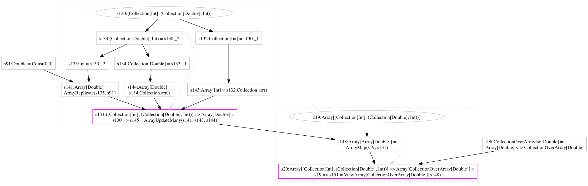

<a name="Idiom13"></a> 
### Idiom 13: Isomorphic Specialization 

Isomorphic specialization is a distinctive feature of Scalan which is based on the previously described idioms. It
allows to automatically specialize (i.e. transfrom) the same program with respect to concrete implementations of abstract
data types, which are used in the program. Consider the following example of matrix-vector multiplication

```scala
import scalan._
import scalan.linalgebra._
var doInvoke = true
class Ctx extends MatricesDslExp { override def invokeAll = doInvoke }
val ctx = new Ctx
import ctx._
lazy val mvm = fun { p: Rep[(Matrix[Double], Vector[Double])] =>
  val Pair(m, v) = p
  DenseVector(m.rows.mapBy( fun{ r => r dot v }))
}
showGraphs(mvm)
```
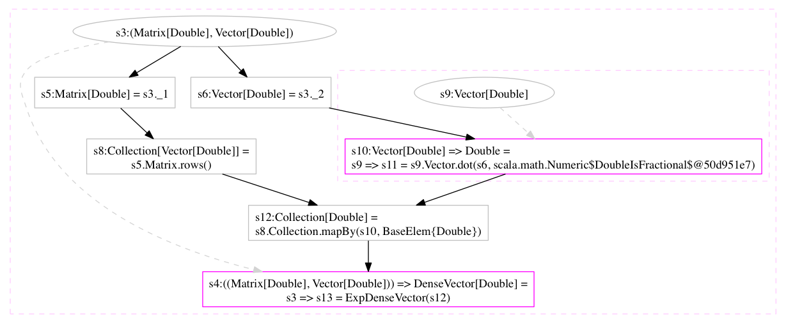

All the method calls remain in the graph because they cannot be invoked. However if we explicitly construct an input
matrix from the concrete implementation, and then invoke `mvm` we get the following graph

```scala
scala>
lazy val ddmvmC = fun { p: Rep[(Collection[Collection[Double]], Collection[Double])] =>
  val Pair(m, v) = p
  val width = m(0).length
  val matrix: Matr[Double] = CompoundMatrix(m.map { r: Coll[Double] => DenseVector(r) }, width)
  val vector: Vec[Double] = DenseVector(v)
  mvm(matrix, vector).items
}
showGraphs(ddmvmC)
```
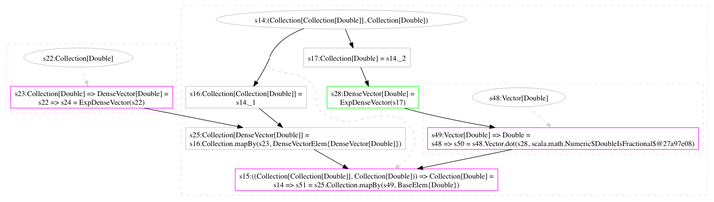

We wrapped `mvm` inocation in the new function `ddmvmC` which effectively means inlining of `mvm` in the body of
`ddmvmC`. As a consequence, the method `rows` of `Matrix` has been invoked and also inlined in the body of `ddmvmC`,
however some method of `Collection` and `Vector` are still reified as delayed method calls. Note, that the input type of
`ddmvmC` has been selected to ensure contruction of the concrete class `CompoundMatrix`.

We can play this trick again by selecting some concrete implementation of `Collection` trait and wrapping `ddmvmC`

```scala
scala>
lazy val ddmvmA = fun { p: Rep[(Array[Array[Double]], Array[Double])] =>
  val Pair(m, v) = p
  val matrix = CollectionOverArray(m.map(r => CollectionOverArray(r)))
  val vector = CollectionOverArray(v)
  ddmvmC(matrix, vector).arr
}
showGraphs(ddmvmA)
```
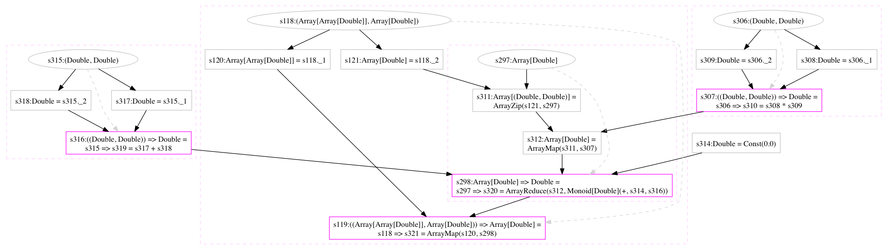

The resulting code contain only `Array` operations which are all supported by Scalan's default codegen and thus this example can be executed.

Note, in these examples we assumed that collections are more concrete that matrix and arrays are more concrete than
collections. But this essentially depend on how the classes are implemented. In our case we selected the matrix class
implemented in terms of collections and the collection class implemented in terms of arrays. The following example show
how to specialize `ddmvmC` with respect to `List` based collections.

```scala
scala>
def ddmvmL = fun { p: Rep[(List[List[Double]], List[Double])] =>
  val Pair(m, v) = p
  val matrix = CollectionOverList(m.map(r => CollectionOverList(r)))
  val vector = CollectionOverList(v)
  ddmvmC(matrix, vector).arr
}
showGraphs(ddmvmA)
```
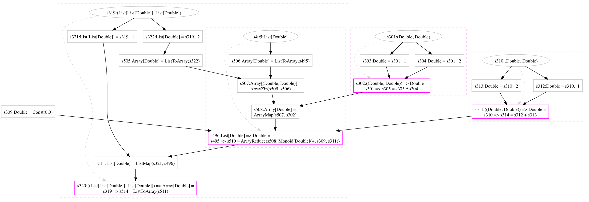

This meta-programming pattern is implemented in Scalan framework by using a set of generic rewrite rules which work for
any user-defined virtualized traits and classes. The the design and formalization of isomorphic specialization is
described in [Isomorphic Specialization by Staged Evaluation paper](http://pat.keldysh.ru/~slesarenko/). See also Scala
Days Amsterdam
[talk](https://www.parleys.com/tutorial/program-functionally-execute-imperatively-peeling-abstraction-overhead-from-functional-programs).

<a name="Idiom14"></a> 
### Idiom 14: Multi-stage Transformation Pipeline 

Staged evaluation of [virtualized code](#Idiom2) produces a graph-based IR of the program under evaluation. The graph IR
can be [re-evaluated](#Idiom5) with a set of rewrite rules constructing a new graph. This process can be repeated many
times with different sets of rewrite rules and other graph transformations. The pipeline of such transformations is
represented in Scalan by
[Compiler](https://github.com/scalan/scalan/blob/master/core/src/main/scala/scalan/compilation/Compiler.scala) object.

### References

1. [Scalan framework](http://github.com/scalan/scalan)
2. [Scalanizer: a Scalan Compiler plugin for hotspot optimizations](https://github.com/scalan/scalanizer)
3. [Scala Days Amsterdam talk](https://www.parleys.com/tutorial/program-functionally-execute-imperatively-peeling-abstraction-overhead-from-functional-programs)
4. [Isomorphic Specialization by Staged Evaluation paper on author's home page](http://pat.keldysh.ru/~slesarenko/)
