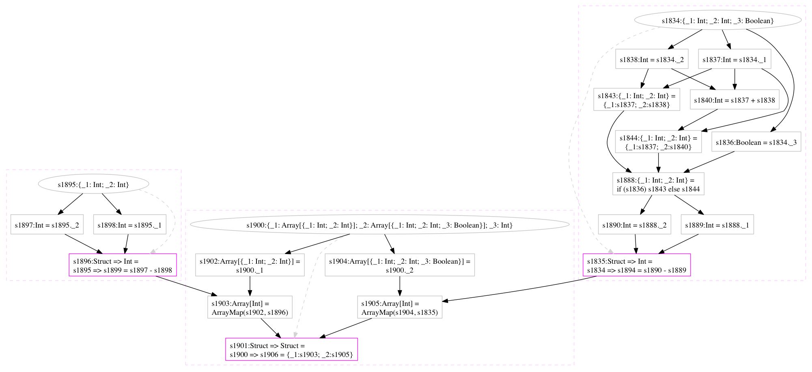

# Scalan's Meta-programming Idioms   

## Intro

Scalan is a framework for development of domain-specific compilers in Scala. In particular it supports meta-programming bases on staged evaluation. Visit [Scalan Readme](https://github.com/scalan/scalan/blob/master/README.md) for general introduction about Scalan and how to get started. 

The following is the introduction to meta-programming idioms available in Scalan shown by examples.

